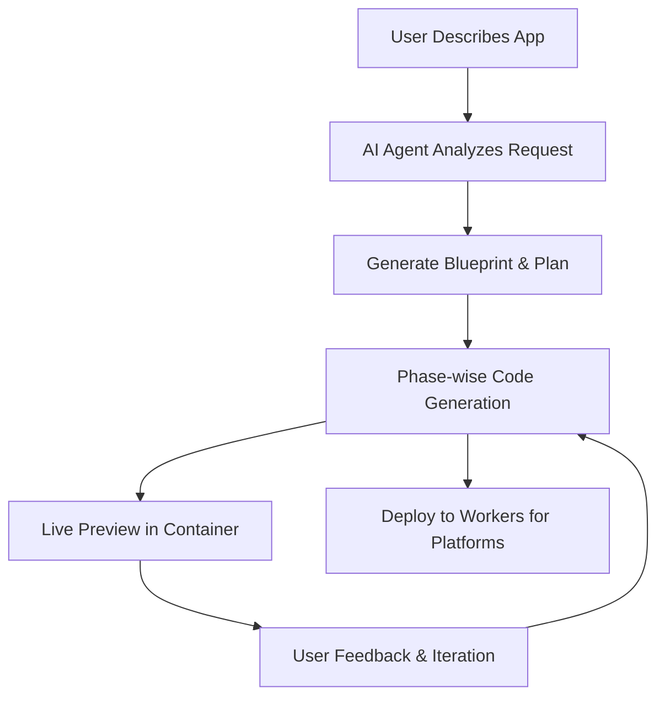

# 🧡 Cloudflare Vibecoding Starter Kit

> **Transform ideas into apps with just text** – Deploy your own instance of Cloudflare Orange Build, the next-generation AI platform that turns your thoughts into fully deployed web applications.

<div align="center">

[](https://deploy.workers.cloudflare.com/?url=https://github.com/AshishKumar4/cloudflare-orange-build)

**👆 Click to deploy your own Cloudflare Orange Build instance!**

*Follow the setup guide below to configure required services*

</div>

---

## 🚀 Deploy to Cloudflare

Ready to deploy your own Cloudflare Orange Build platform? The process takes about 5 minutes with proper setup:

**Step 1: Click Deploy Button** 🔗  
Click the deploy button above to start the process

**Step 2: Connect Git Account** ☁️  
Connect your GitHub/Gitlab account to Cloudflare  

**Step 3: Configure Services** ⚙️  
You'll be prompted to configure the required services below

**Step 4: Deploy** 🚀  
Once configured, deployment happens automatically

---

## ⚙️ Required Configuration

During deployment, you'll need to configure these **mandatory** services. Have them ready before clicking deploy:

### 🔑 1. Cloudflare API Token (Required)

Create an API token with these specific permissions:

1. Go to [Cloudflare Dashboard](https://dash.cloudflare.com) → **My Profile** → **API Tokens**
2. Click **Create Token** → **Custom Token**
3. Add these **exact permissions**:

   **Account permissions:**
   - `Workers Scripts: Edit`
   - `Workers AI: Edit` 
   - `D1: Edit`
   - `Workers KV Storage: Edit`
   - `Workers R2 Storage: Edit`
   - `Account Settings: Read`
   - `User Details: Read`

   **Zone permissions (for all zones):**
   - `Workers Routes: Edit`

4. Set **Account Resources** to `Include: All accounts`
5. Click **Continue to Summary** → **Create Token**
6. **Save this token** - you'll need it during deployment

### 🤖 2. AI Gateway Setup (Conditional)

Cloudflare Orange Build requires an authenticated AI Gateway, but **setup is automatic if you provide the right token**:

#### Option A: Automatic Setup (Recommended)
If you have a `CLOUDFLARE_AI_GATEWAY_TOKEN` with **Read, Edit, and Run** permissions, the deployment script will automatically create and configure the AI Gateway for you. **No manual setup required!**

#### Option B: Manual Setup (If no token provided)
Only if you **don't** have an AI Gateway token, manually create one:

1. Go to [AI Gateway Dashboard](https://dash.cloudflare.com/ai/ai-gateway)
2. Click **Create Gateway**
3. Name: `orange-build-gateway` (or your preferred name)
4. **Important**: Enable **Authenticated Gateway** 
5. Click **Create authentication token**
6. Configure token with **AI Gateway Run** permissions
7. **Save both**:
   - Gateway URL: `https://gateway.ai.cloudflare.com/v1/{account-id}/{gateway-name}`
   - Authentication token

### 🔐 3. Required Environment Variables (Required)

You'll need to provide these exact environment variable names during deployment:

**Cloudflare Configuration:**
- `CLOUDFLARE_API_TOKEN` - Your Cloudflare API token (from step 1)
- `CLOUDFLARE_ACCOUNT_ID` - Your Cloudflare Account ID  

**AI Provider API Keys (Required):**
> **⚠️ Currently Required**: The following AI provider API keys are mandatory for the platform to function. We are actively working to make these optional and easily configurable in future releases.

- `OPENAI_API_KEY` - Your OpenAI API key for GPT models
- `ANTHROPIC_API_KEY` - Your Anthropic API key for Claude models  
- `GEMINI_API_KEY` - Your Google Gemini API key for Gemini models

> **💡 AI Gateway Wholesaling Alternative**: If you have **AI Gateway Wholesaling** enabled on your Cloudflare account, you can skip the individual provider API keys above. Instead, you'll need your AI Gateway token with proper Run permissions.

**AI Gateway Configuration:**
- `CLOUDFLARE_AI_GATEWAY_TOKEN` - **HIGHLY RECOMMENDED** - AI Gateway token with Read, Edit, and **Run** permissions
  
> **💡 Automatic vs Manual Setup**: 
> - **With token**: Deployment automatically creates and configures AI Gateway for you
> - **Without token**: You must manually create AI Gateway named `orange-build-gateway` (or custom name) before deployment

**Optional AI Gateway Settings:**
- `CLOUDFLARE_AI_GATEWAY` - Gateway name (default: `orange-build-gateway`)
- `CLOUDFLARE_AI_GATEWAY_URL` - Custom gateway URL (auto-generated if not provided)

**Required Secrets:**
```bash
# Generate these secrets
JWT_SECRET='some-secure-random-string'
```

**Environment:**
- `ENVIRONMENT=production` (for production deployment)

### 🔗 4. OAuth Setup (Optional)

For user authentication (can skip for testing):

**Google OAuth:**
1. [Google Cloud Console](https://console.cloud.google.com) → Create Project
2. Enable **Google+ API** 
3. Create **OAuth 2.0 Client ID**
4. Add authorized origins: `https://your-worker-name.workers.dev`
5. Add redirect URI: `https://your-worker-name.workers.dev/api/auth/google/callback`
6. Configure these environment variables:
   - `GOOGLE_CLIENT_ID` - Your Google Client ID
   - `GOOGLE_CLIENT_SECRET` - Your Google Client Secret

**GitHub OAuth:**
1. GitHub → **Settings** → **Developer settings** → **OAuth Apps**
2. Click **New OAuth App**
3. Application name: `Cloudflare Orange Build`
4. Homepage URL: `https://your-worker-name.workers.dev`
5. Authorization callback URL: `https://your-worker-name.workers.dev/api/auth/github/callback`
6. Configure these environment variables:
   - `GITHUB_CLIENT_ID` - Your GitHub Client ID
   - `GITHUB_CLIENT_SECRET` - Your GitHub Client Secret
---

## 📋 Configuration Checklist

Before clicking deploy, ensure you have:

**Essential Requirements:**
- ✅ **CLOUDFLARE_API_TOKEN** with all required permissions
- ✅ **CLOUDFLARE_ACCOUNT_ID** from your dashboard
- ✅ **AI Provider API Keys** (all three required):
  - `OPENAI_API_KEY` - OpenAI API access
  - `ANTHROPIC_API_KEY` - Anthropic Claude API access  
  - `GEMINI_API_KEY` - Google Gemini API access
- ✅ **JWT_SECRET** - Secure random string

**Highly Recommended:**
- ✅ **CLOUDFLARE_AI_GATEWAY_TOKEN** - AI Gateway token with Read, Edit, and **Run** permissions
  - *Without this, you must manually create the AI Gateway before deployment*

**Optional:**
- ⚪ **OAuth credentials** (GOOGLE_CLIENT_ID, GITHUB_CLIENT_ID, etc.)
- ⚪ **Custom AI Gateway settings** (CLOUDFLARE_AI_GATEWAY, CLOUDFLARE_AI_GATEWAY_URL)

> **💡 AI Gateway Wholesaling Users**: If you have AI Gateway Wholesaling enabled, you can skip the individual AI provider API keys and just use your AI Gateway token with Run permissions.

---

## ✨ What is Cloudflare Orange Build?

Cloudflare Orange Build is a revolutionary **text-to-app** platform that demonstrates the full power of Cloudflare's developer ecosystem. Simply describe what you want to build in plain English, and watch as AI agents create, deploy, and iterate on complete web applications in real-time.

### 🎯 Key Features

🤖 **AI Code Generation** – Phase-wise development with intelligent error correction  
⚡ **Live Previews** – See your app running instantly in sandboxed containers  
💬 **Interactive Chat** – Guide development through natural conversation  
📱 **Modern Stack** – Generates React + TypeScript + Tailwind apps  
🚀 **One-Click Deploy** – Deploy generated apps to Workers for Platforms  
📦 **GitHub Integration** – Export code directly to your repositories  

### 🏗️ Built on Cloudflare's Platform

Cloudflare Orange Build showcases the entire Cloudflare developer ecosystem:

- **Frontend**: React + Vite with modern UI components
- **Backend**: Workers with Durable Objects for AI agents  
- **Database**: D1 (SQLite) with Drizzle ORM
- **AI**: Multiple LLM providers via AI Gateway
- **Containers**: Sandboxed app previews and execution
- **Storage**: R2 buckets for templates, KV for sessions
- **Deployment**: Workers for Platforms with dispatch namespaces

---

## 💡 Try These Example Prompts

Once deployed, try these prompts to see Cloudflare Orange Build in action:

**🎮 Fun Apps**
> "Create a todo list with drag and drop and dark mode"

> "Build a simple drawing app with different brush sizes and colors"

> "Make a memory card game with emojis"

**📊 Productivity Apps**  
> "Create an expense tracker with charts and categories"

> "Build a pomodoro timer with task management"

> "Make a habit tracker with streak counters"

**🎨 Creative Tools**
> "Build a color palette generator from images"

> "Create a markdown editor with live preview"  

> "Make a meme generator with text overlays"

**🛠️ Utility Apps**
> "Create a QR code generator and scanner"

> "Build a password generator with custom options"

> "Make a URL shortener with click analytics"

---

## 🎨 How It Works



### The Magic Behind the Scenes

1. **🧠 AI Analysis**: Advanced language models process your description
2. **📋 Blueprint Creation**: System architecture and file structure planned
3. **⚡ Phase Generation**: Code generated incrementally with smart dependency management
4. **🔍 Quality Assurance**: Automated linting, type checking, and error correction
5. **📱 Live Preview**: Instant app execution in isolated Cloudflare Containers
6. **🔄 Real-time Iteration**: Chat interface enables continuous refinements
7. **🚀 One-Click Deploy**: Generated apps deploy instantly to Workers for Platforms

---

## 🌍 Architecture Deep Dive

### Durable Objects for Stateful AI Agents
```typescript
class CodeGeneratorAgent extends DurableObject {
  async generateCode(prompt: string) {
    // Persistent state across WebSocket connections
    // Phase-wise generation with error recovery
    // Real-time progress streaming to frontend
  }
}
```

### Workers for Platforms Deployment
```javascript
// Generated apps deployed to dispatch namespace
export default {
  async fetch(request, env) {
    const appId = extractAppId(request);
    const userApp = env.DISPATCHER.get(appId);
    return await userApp.fetch(request);
  }
};
```

### Phase-wise Code Generation
Cloudflare Orange Build generates apps in intelligent phases:

1. **Planning Phase**: Analyzes requirements, creates file structure
2. **Foundation Phase**: Generates package.json, basic setup files  
3. **Core Phase**: Creates main components and logic
4. **Styling Phase**: Adds CSS and visual design
5. **Integration Phase**: Connects APIs and external services
6. **Optimization Phase**: Performance improvements and error fixes

---

## 🎯 Perfect For

### 🚀 **Rapid Prototyping**
Turn ideas into working apps in minutes, not days

### 📚 **Learning Web Development** 
See modern React patterns generated and explained in real-time

### 🏢 **Client Demos**
Create impressive proof-of-concepts for stakeholders instantly

### ⚡ **Hackathons**
Build and deploy complete applications faster than anyone else

### 🔬 **Platform Exploration**
Experience the full power of Cloudflare's developer platform

---

## 📊 System Requirements

### For Users
- **Cloudflare Account** (Workers paid plan recommended for full features)
- **GitHub Account** (free)
- **Modern Browser** (Chrome 90+, Firefox 88+, Safari 14+)

### Auto-Provisioned Resources
The deploy button automatically creates:
- **D1 Database** (SQLite at the edge)
- **Durable Objects** (stateful serverless objects)
- **R2 Storage** (object storage for templates)
- **KV Storage** (key-value storage for sessions)
- **Workers AI Binding** (if enabled)
- **Dispatch Namespace** (for user app deployment)

---

## ❓ Troubleshooting

### Common Deploy Issues

**🚫 "Insufficient Permissions" Error**
- Ensure your API token has ALL required permissions listed above
- Check that token hasn't expired
- Verify account access is set to "Include all accounts"

**🤖 "AI Gateway Authentication Failed"**  
- Confirm AI Gateway is set to **Authenticated** mode
- Verify the authentication token has **Run** permissions
- Check that gateway URL format is correct

**🗄️ "Database Migration Failed"**
- Ensure API token has **D1 Edit** permissions
- Check that account has D1 access enabled
- Wait a few minutes and retry - D1 resources may take time to provision

**🔐 "Missing Required Environment Variables"**
- **AI Provider API Keys**: Verify all three are set: `OPENAI_API_KEY`, `ANTHROPIC_API_KEY`, `GEMINI_API_KEY`
- **Cloudflare Variables**: Ensure `CLOUDFLARE_API_TOKEN` and `CLOUDFLARE_ACCOUNT_ID` are set
- **JWT Secret**: `JWT_SECRET` is required - generate a secure random string
- **AI Gateway Token**: `CLOUDFLARE_AI_GATEWAY_TOKEN` is highly recommended for automatic setup

**🤖 "AI Gateway Not Found"**
- **With AI Gateway Token**: The deployment script should automatically create the gateway. Check that your token has Read, Edit, and **Run** permissions.
- **Without AI Gateway Token**: You must manually create an AI Gateway before deployment:
  1. Go to [AI Gateway Dashboard](https://dash.cloudflare.com/ai/ai-gateway)
  2. Create gateway named `orange-build-gateway` (or your custom name)
  3. Enable authentication and create a token with **Run** permissions

**💡 "AI Gateway Wholesaling"**
- Users with AI Gateway Wholesaling can skip individual provider API keys
- Ensure your AI Gateway token has proper Run permissions for all providers

### Need Help?

- 📖 Check [Cloudflare Workers Docs](https://developers.cloudflare.com/workers/)
- 💬 Join [Cloudflare Discord](https://discord.gg/cloudflaredev)
- 🐛 Report issues on [GitHub](https://github.com/your-org/cloudflare-vibecoding-starter-kit/issues)

---

## 🏠 Local Development

Here's how to run it locally:

### Prerequisites
- Node.js 18+, Cloudflare account with Workers paid plan

### Quick Setup
```bash
git clone https://github.com/your-username/cloudflare-vibecoding-starter-kit.git
cd cloudflare-vibecoding-starter-kit && bun install

cp .dev.vars.example .dev.vars
# Edit .dev.vars with proper values

bun run install
bun run db:generate && bun run db:migrate:local
bun run dev

# To deploy
bun run deploy
```

### Development Commands
```bash
bun run dev              # Start development servers
bun run build            # Build for production
bun run deploy           # Deploy to Cloudflare
bun run db:generate && bun run db:migrate:local
bun run lint             # Run code quality checks
```

---

## 🔒 Security & Privacy

Cloudflare Orange Build implements enterprise-grade security:

- 🔐 **Encrypted Secrets**: All API keys stored with Cloudflare encryption
- 🏰 **Sandboxed Execution**: Generated apps run in completely isolated containers
- 🛡️ **Input Validation**: All user inputs sanitized and validated
- 🚨 **Rate Limiting**: Prevents abuse and ensures fair usage
- 🔍 **Content Filtering**: AI-powered detection of inappropriate content
- 📝 **Audit Logs**: Complete tracking of all generation activities

---

## 🤝 Contributing

Love Cloudflare Orange Build? Here's how to contribute:

1. **🍴 Fork** via the Deploy button (creates your own instance!)
2. **💻 Develop** new features or improvements  
3. **✅ Test** thoroughly with `bun run test`
4. **📤 Submit** Pull Request to the main repository

### Development Focus Areas
- 🧠 **AI Models**: Add support for new LLM providers
- 🎨 **Templates**: Create new app templates and frameworks
- 🔧 **Tools**: Improve code generation and error handling
- 📱 **UI/UX**: Enhance the chat interface and preview experience

---

## 📚 Resources

### 🛠️ **Cloudflare Platform**
- [Workers](https://developers.cloudflare.com/workers/) - Serverless compute platform
- [Durable Objects](https://developers.cloudflare.com/durable-objects/) - Stateful serverless objects
- [D1](https://developers.cloudflare.com/d1/) - SQLite database at the edge
- [R2](https://developers.cloudflare.com/r2/) - Object storage without egress fees
- [AI Gateway](https://developers.cloudflare.com/ai-gateway/) - Unified AI API gateway

### 💬 **Community**  
- [Discord](https://discord.gg/cloudflaredev) - Real-time chat and support
- [Community Forum](https://community.cloudflare.com/) - Technical discussions
- [GitHub Discussions](https://github.com/your-org/cloudflare-vibecoding-starter-kit/discussions) - Feature requests and ideas

### 🎓 **Learning Resources**
- [Workers Learning Path](https://developers.cloudflare.com/learning-paths/workers/) - Master Workers development
- [Full-Stack Guide](https://developers.cloudflare.com/pages/tutorials/build-a-blog-using-nuxt-and-sanity/) - Build complete applications
- [AI Integration](https://developers.cloudflare.com/workers-ai/) - Add AI to your apps

---

## 📄 License

MIT License - see [LICENSE](LICENSE) for details.

---

<div align="center">

### 🧡 Ready to Build the Future?

**Transform your ideas into reality with proper setup**

[](https://deploy.workers.cloudflare.com/?url=https://github.com/your-org/cloudflare-vibecoding-starter-kit)

*Make sure to complete the configuration steps above first*

---

[🌟 Star on GitHub](https://github.com/your-org/cloudflare-vibecoding-starter-kit) • [📖 Documentation](./CLAUDE.md) • [💬 Community](https://discord.gg/cloudflaredev) • [🚀 Live Demo](https://build.cloudflare.dev)

**Built with ❤️ on Cloudflare's Developer Platform**

</div>